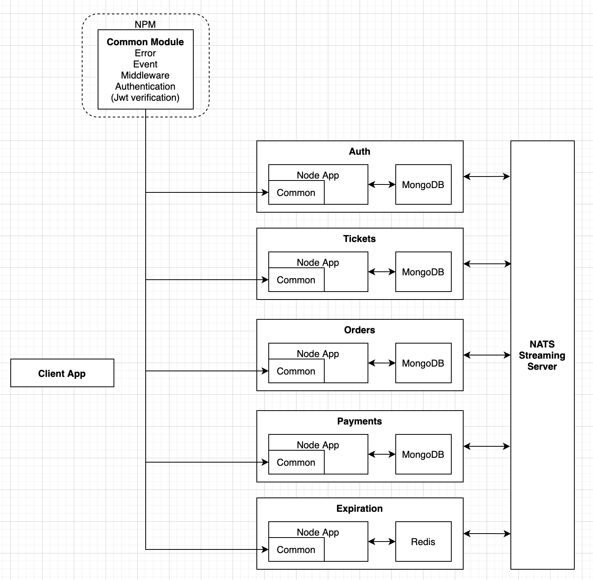
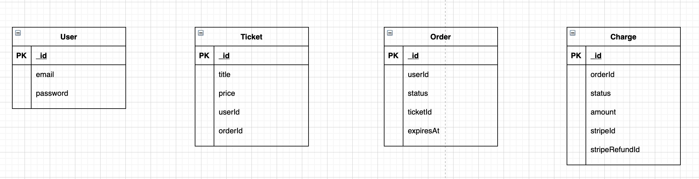

# Ticketing Service

본 프로젝트는 쿠버네티스를 사용한 마이크로서비스 기반 어플리케이션입니다. [Stephen Grider, Microservices with Node JS and React (Udemy)](https://www.udemy.com/course/microservices-with-node-js-and-react)강의를 참조하여 개발하였습니다.

## Architecture

다음과 같은 서비스들로 구성되어 있습니다.

* 인증서비스 - 회원가입, 로그인등의 인증관련 정보를 관리합니다.
* 티켓팅서비스 - 티켓에 대한 목록 모여주고 티켓정보를 관리합니다.
* 주문서비스 - 티켓서비스에서 제공하는 티켓에 대한 주문을 담당하는 서비스입니다.
* 지불서비스 - 주문서비스에 주문된 티켓들의 요금을 지불하는 서비스입니다.
* 이벤트 메시지큐 - 여러 서비스들이 통신을 위해 이벤트를 발행하고 처리하는 메시징 시스템입니다. 각 서비스들은 다른서비스의 API를 호출하기 위해 이벤트를 큐에 발급하고 해당 토픽을 구독하는 서비스들은 메시지가 발급되면 처리합니다.
* 공통모듈 - 로그인 인증(jwt), 예외, 이벤트타입(다른 서비스들이 통신을 위해 발행 하는 이벤트), 유효성처리 미들웨어등 여러 서비스들이 공통적으로 포함해야할 코드를 공통모듈로 npm에 배포해 각 서비스에 종속성을 포함합니다.
* 클라이언트 - React와 Next 기반의 웹어플리케이션입니다. 서버사이드렌더링을 지원합니다.

## 데이터베이스 모델링

각 데이터의 _id는 MongoDB의 키에 해당합니다.

## 인증

로그인에 대한 인증을 jwt를 쿠키로 저장하고 사용합니다. 쿠키를 위해 [cookit-session](https://github.com/expressjs/cookie-session#readme)을 사용하며 클라이언트 사이드에서 인증에 대한 쿠키를 보관하기 때문에 모든 서비스에 걸처 존재하는 인증 미들웨어에서 인증가능합니다.

## 테스트

각 서비스를 구성하는 API들은 [supertest](https://github.com/visionmedia/supertest#readme)를 사용한 단위테스트를 진행합니다. 각 서비스의 routes/__test__ 에 포함되어 있습니다.

## 여러 서비스에 사용되는 공통모듈

공통모듈에 포함된 예외, 이벤트타입, 미들웨어는 하나의 패키지로 npm에 배포되어 각 서비스의 종속성에 포함되어 사용됩니다.

## References

* [Stephen Grider, Microservices with Node JS and React (Udemy)](https://www.udemy.com/course/microservices-with-node-js-and-react)